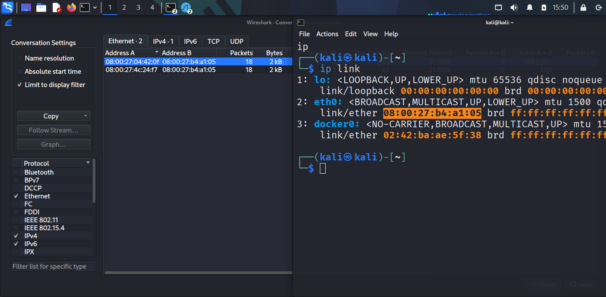

# Network Monitoring & Attack Detection

## Overview

In this project, I simulated simulated a cyber attack (Man-In-The-Middle) using virtual machines on my main computer. I used two Kali Linux VMs and metasploitable2 as the third set up in VirtualBox. The goal was to make one VM (the "attacker") trick the other two VMs (the "victims") into sending their network traffic through it. I did this using a technique called ARP spoofing, which confuses the victims about where to send their data. Then, I captured that traffic with a tool called Ettercap and saved it as a file (PCAP) to study what happened using Wireshark. This project helps to understand how network attacks work and how to spot them, all in a safe, isolated setup so no real systems are harmed.

## Network Setup

To start, I set up three virtual machines (VMs) using in VirtualBox. Here’s how I configured them:

- **Kali 1 (Attacker Machine)**: This VM acts like the "bad guy" that intercepts traffic. IP address `192.168.56.108` and its network card (MAC address) is `08:00:27:b4:a1:05`.
- **Kali 2**: This is the first victim VM with the IP address `192.168.56.128` and MAC address `08:00:27:4c:24:f7`.
- **Kali 3**: This is the second victim VM with the IP address `192.168.56.102`. and MAC address `08:00:27:04:42:0f`

I connected all three VMs using a "Host-Only Network" in VirtualBox, which is like a private playground where they can talk to each other but not to the outside internet. This keeps everything safe. To set this up:
- I tested that they could "ping" each other 2, it worked!
- I then enterred `ip neighbour` to check the initial mac addresses of the victims before poisoning.


- I did same on the attacker machine to make sure I could communicate with the victims


This setup created a simple network where Kali 2 and Kali 3 could send messages (ping packets) to each other, and Kali 1 would try to get in the middle.

## Attack and Detection

I used a tool called Ettercap on Kali 1 to perform ARP spoofing, which is like tricking Kali 2 and Kali 3 into thinking Kali 1 is the other machine. Here’s what I did step by step:

1. On Kali 1, I installed Wireshark and Ettercap by typing `sudo apt update && sudo apt install wireshark ettercap-text-only -y`. Wireshark helps me analyze the traffic, and Ettercap does the attack.
2. On Kali 2 (the victim), I ran `ip neighbor` to see its ARP table (a list of IP-to-MAC address mappings). It showed :
   
   This means Kali 2 knew Kali 3’s real MAC address before the attack.
   
4. I started the attack by running :
   ```
   sudo ettercap -T -q -i eth0 --write saved.pcap --mitm arp //192.168.56.128// //192.168.56.102//
   ```
    
   
    `-T` makes it show text output, `-q` keeps it quiet, `-i eth0` uses the network card, `--write mitm-saved.pcap` saves the traffic to a file, `--mitm arp` does the ARP spoofing, and the IPs target Kali 2 and Kali 3.

    
   
6. On Kali 2, I ran `ip neighbor` again to check ARP Cache After the attack and saw:
   

   Now, Kali 2 thinks Kali 3’s IP (`192.168.56.102`) belongs to Kali 1’s MAC (`08:00:27:b4:a1:05`), proving the spoofing worked!
   
6. On Kali 2, I sent 5 ping requests `ping -c 5 192.168.56.102` to Kali 3, and on Kali 3, I typed `ping -c 5 192.168.56.128` to send 5 pings to Kali 2. This created traffic for Kali 1 to catch.
   
   
8. I pressed `Ctrl+C` on Kali 1 to stop Ettercap.

This process let Kali 1 pretend to be both Kali 2 and Kali 3, forcing their ping traffic to go through it.

## Pcap Analysis

After capturing the traffic, I used Wireshark on Kali 1 to check the `saved.pcap` file and make sure the pings were redirected through Kali 1. 


Here’s how I did it, explained simply:

1. I opened `saved.pcap` in Wireshark on Kali 1.
   ```
   wireshark saved.pcap
   ```
2. I typed `icmp` in the filter bar and pressed Enter to see only the ping packets.
   
   
3. I picked a packet where the source was `192.168.56.128` (Kali 2) and the destination was `192.168.56.102` (Kali 3). When I expanded the "Ethernet II" section (Layer 2 of the OSI model - Data Link Layer), the destination MAC was `08:00:27:b4:a1:05` which = Kali 1’s MAC! This means the packet was sent to Kali 1 instead of directly to Kali 3, proving redirection.
   
   
4. I checked `Statistics > Conversations`, clicked the "Ethernet II" tab, and noticed that the source MAC addresses (Address A) for Kali 2 and 3 were right but the destination MAC address was that of Kali 1. This clearly shows ARP spoofing!
   
   
6. In the Ethernet section of several packets, I noticed the source or destination MAC was `08:00:27:b4:a1:05` (Kali 1’s MAC). This confirms Kali 1 was in the middle therefore when a ping request from Kali 2 to Kali 3 is sent, it's redirected through Kali 1 and when the request reaches Kali 3, Kali 1 becomes the source. Simple, right?
   

This is just to show that the ping packets didn’t go straight from Kali 2 to Kali 3 nor from Kali 3 to Kali 2...they went through Kali 1 because of the ARP spoofing!

## Mitigation Recommendations

To protect against attacks like this, here are some easy steps anyone can take:

- **Limit Ping Traffic**: Set up a firewall to allow only a few ping packets per second (imagine if I had sent 100 packets). A tool like `iptables` can help with this. This stops flood attacks.
- **Watch the Network**: Use tools like an Intrusion Detection System (IDS) or Intrusion Prevention System (IPS) to spot unusual traffic, like ARP spoofing, and get alerts.
- **Lock Down ARP**: Create static ARP tables (a fixed list of IP-to-MAC mappings) on devices to prevent spoofing.

These steps make it harder for attackers to trick your network and keep your data safe.


